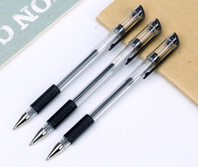

# 国民用笔

至于题主所说“一般的笔”，我把它理解成“使用独立笔芯的滚珠书写笔”，例如中性笔或者圆珠笔
尽管这两类笔的笔尖与直液式走珠笔一样，都是滚珠结构，但二者的出水结构是不同的。

中性笔和圆珠笔使用独立的笔芯，笔杆本身没有参与“出水”过程的结构，所以不能称为“直液式走珠笔”。
由于没有毛细结构作为“中转站”，笔芯中的墨水是直接到达笔尖的，因此这类笔不能使用流动性太好的墨水，
而是使用更加粘稠的墨水防止漏墨和下水太猛。

总结一下，就是：“直液式走珠笔是一种出水结构类似于钢笔的走珠笔，
其中‘直液’两个字意味着墨水流经笔杆自身所具备的毛细结构到达笔尖（而不需要借助笔芯这一容器）。
此类笔拥有墨水流动性好、书写稳定、储墨量大等优点，其与传统走珠笔的最大区别是有无毛细结构以及使用的墨水类型”。

# 圆珠笔
球珠滚动带出书写介质形成字迹的书写工具统称为圆珠笔
* 其书写介质的粘度介与水性和油性之间称为中性笔
* 其书写介质为水性墨水的称为水性圆珠笔（滚珠笔）

# 中性笔
中性墨水圆珠笔的简称，起源于日本
中性笔兼具自来水笔和油性圆珠笔的优点，书写手感舒适
中性笔笔尖尺寸大致分为1.0mm和0.5mm两
质量：笔尖质量、墨水质量

使用场所：
>> 文件专用中性笔
>>>> 所采用的油墨为颜料型，耐水、耐晒、不褪色
>> 考试专用笔”，其实，它也属于“文件专用中性笔”这一类别，必须采用颜料型油墨。但是，由于颜料型油墨成本更高

# 记号笔
* 水性记号笔
记号笔是一种可在纸张、木材、金属、塑料、搪陶瓷等一种或多种材料上书写作记号或标志的笔。
记号笔分为油性记号笔和水性记号笔
水性记号笔:water-baseinkmarker使用水性墨水进行书写，主要用于纸张表面的记号笔。
白板用记号笔:white board marker可在搪瓷、烘漆、贴塑等白板或色板表面书写，字迹容易擦去的记号笔。
荧光记号笔:fluorescentpen；high lighter书写介质中含有荧光材料，作醒目记号或标志的记号笔。常用色有荧光黄，柠檬黄，淡紫，淡粉，绿色，天蓝等。

>> 记号笔也叫马克笔，麦克笔。有标准的12色
主要有永久附著，不脱色的特点。可以用酒精等有机溶剂擦去笔迹

# 荧光笔
荧光笔是近几年新出的做记号用的笔，用较粗、较淡的墨水覆盖关键部位来做记号，做上记号后，
不遮挡住文字一目了然。荧光笔有荧光剂，它遇到紫外线（太阳光、日光灯、水银灯比较多）时会产生荧光效应，发出白光，从而使颜色看起来有刺眼的荧光感觉。常用于办公学习。

# 走珠笔
它由笔帽、笔头体、储墨装置、笔杆构成。因为与中性笔出水方式和结构略有不同因此称走珠笔。
直液式走珠笔=钢笔+圆珠笔结合体
代表型号: 三菱的UB-150，百乐V5
而直液式走珠笔是一种借鉴了钢笔结构的走珠笔，与传统的走珠笔（使用笔芯的）相比，
它的优点是储墨量更大，墨水流动性更好，出水更稳定，且不容易从笔芯后边漏墨。
缺点是对墨水流动性要求比较高，其墨水的性质往往与钢笔墨水相似，相比中性笔的墨水更“稀”，
黑度和防水性有时候会打折扣（前面提到的百乐V5的墨水就与钢笔墨水类似，不防水，但三菱UB-150使用了防水的颜料墨水，黑度和防水性能都很不错）。
新版百乐V5是一支与钢笔结构无限接近的笔，除了毛细结构外，还有与百乐钢笔口径一致的可替换的墨胆（毕竟墨胆这玩意儿最早是用在钢笔上的）；而三菱UB-151则属于一次性走珠笔，使用笔杆储存墨水以提高使用寿命，理论上用完即丢，不能换墨水，但使劲拔出笔头毛细，用滴管或者注射器加墨水继续使用也未尝不可。

# 精品（Competitive products）
物质中最纯粹的部分，提炼出来的物件
精品店专门出售各种精美服饰商品的小型商店
品店的销售以较小的群体为目标消费者，常以高级时装、饰品、珠宝、皮包、手套、领带、皮鞋和化妆品为商品。

而现代的精品店流行的是出售一些小型精品，可以营销的范围非常多，可以是一些小饰品、小礼物也可以是鞋包、服装等等，而商品必须足够精致。
往往商品种类繁多商品精致的礼品店也可能被叫做精品店。

